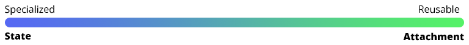

# Motor Components
Motor components are the smallest building block of movement in Tsuki2D.

There are two kinds of motor components.
* MotorStates
* MotorAttachment

MotorStates are supposed to be unique states of very defined movement.

Examples of motor states:
* Wall Climbing
* Sliding
* Dashing
* Grounded
* Mid Air
  
**Motor Attachments** behave like "plugins" for motor states. They are small, reusable components 
that add small functionality to your movement, for example:
* Double Jump (DoubleJumpAttachment)
* Changing the gravity of the motor (OverrideGravityAttachment)
* Invoking events
  * On `Begin` and `End` *(EventAttachment)*
  * When support state changes *(SupportStateAttachment)*
  

**When to make something a State or an Attachment?** That's up to your intuition.
A general approach to be taken, is to initially make your movement logic a state.
However, as soon as you notice that you might want to reuse it in multiple states, 
then refactor it into an attachment. 